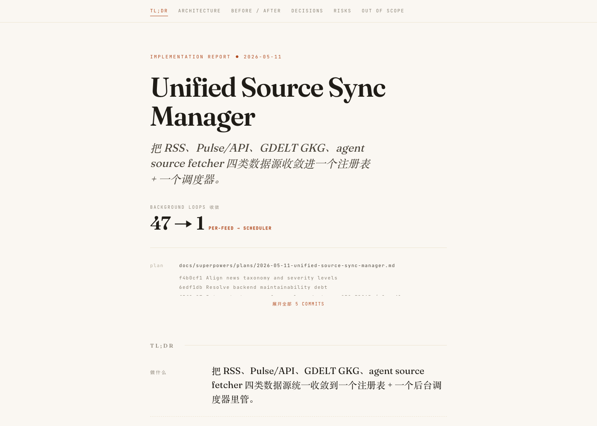
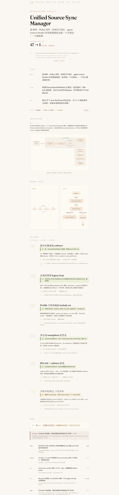

<div align="center">

**中文** · [English](README.en.md)

# impl-explain

**Cross-agent skill for one-page HTML implementation reports**

把"刚做完的实施 + git 历史"渲染成一份**单文件 HTML 叙事报告**。
开会前 30 秒发到 Slack，团队读 60 秒对齐"做了什么 / 为什么这么做 / 有什么风险"。

<br>

[](https://www.python.org)
[](#compatibility)
[](#install)
[](#roadmap)

[Install](#install) · [Usage](#usage) · [What you get](#what-you-get) · [Why](#why-this-exists)

</div>

<br>



---

## Why this exists

AI agent 写代码极快——快到团队成员根本来不及看清实施方案、架构、决策。

代码细节随时 `git diff` 拿得到。但**只存在于实施当时**的信息呢？

- 你为什么选 A 不选 B
- 哪些事**故意没做**
- 哪些事**可能出问题**

`impl-explain` 把这些信息从 plan + git context 里抽出来，渲染成一份单文件 HTML——
**不是 changelog，不是 dashboard，是叙事。**

## What you get

每份 HTML 报告包含以下结构（缺失段优雅跳过）：

| Section | 内容 |
| --- | --- |
| **Hero** | 衬线大标题 · 副标题 · 1-3 个 metric chip · plan path · commits 折叠 |
| **TL;DR** | 三行：**做什么 / 怎么做 / 代价**（整体账，不复述决策局部 cost）|
| **Risk preview** | TL;DR 尾的一行风险预告 + → Risks 跳转锚 |
| **Architecture** | Mermaid 流程图 · 可选上方 summary 叙述 · 下方 caption 颜色编码说明 |
| **Before / After** | 数据流改动前后并排对比（mermaid）|
| **Decisions** | 编号决策卡片：结论式短标题 · 采用 / 理由 / 放弃 / 代价 · `chosen` 或 `deferred` 状态 |
| **Risks** | 风险列表 · 顶部 snapshot · Top risk inline highlight · severity 染色 · mitigation 三态 |
| **Out of Scope** | 故意没做的事 |
| _顶部_ | sticky TOC（6 锚点）+ 滚动 progress bar |

视觉风格：**浅色编辑风**（warm cream + Fraunces 衬线 + Inter 正文 + JetBrains Mono 标签），不是 dashboard。

完整样例 → [`examples/unified-source-sync-manager.html`](examples/unified-source-sync-manager.html)（git clone 后直接双击）。

<details>
<summary>预览完整报告（点击展开）</summary>

<br>



</details>

## Install

### 一行装好

```bash
git clone https://github.com/tt-a1i/impl-explain.git
cd impl-explain
./install.sh
```

安装会把 skill 部署到三家 agent 都能读到的位置，并写入 `~/.config/impl-explain/manifest.json` 让 skill **跨仓库可达**。Claude Code 自动暴露 `/impl-explain`，无需额外配置。

### 开发模式（symlink）

```bash
./install.sh --link
```

边改 skill 边迭代——目标位置 symlink 到源仓库，源改了立即生效。

### 其他命令

```bash
./install.sh --force        # 覆盖已存在的安装（修改源后必跑）
./install.sh --status       # 检查 4 份副本是否与源同步
./install.sh --uninstall    # 移除所有安装位置
./install.sh --help
```

> **Copy 模式 staleness 提醒**：默认 copy 模式下 4 份副本独立。修改源仓库后必须重跑 `./install.sh --force`，否则副本不会更新。用 `--status` 随时检查漂移。

## Usage

实施工作做完后（plan 写好 · 代码 commit），在 agent 会话里：

| Agent | 触发 | 备注 |
| --- | --- | --- |
| **Claude Code** | `/impl-explain` | 原生 slash，零配置 |
| **Codex CLI** | `/impl-explain` 或 `/skills` 菜单 | Custom prompts 是 fallback（已被官方标 deprecated）|
| **opencode** | `/impl-explain` | Commands 壳子先尝试原生 `skill()` 工具，失败再读文件 |

可选参数：plan 文件路径。例：`/impl-explain docs/plans/2026-05-11-foo.md`。

Agent 会自动：

```
1. 找到 plan 文件 ─ 多 plan 仓库用 commit 关键词交叉验证, 必要时问用户
2. 跑 git log + git diff --name-status 收集 commits
3. 综合 JSON
4. 调 render.py 生成 HTML
5. 把绝对路径告诉你
```

HTML 输出到 `git rev-parse --show-toplevel` 算出的项目根 `impl-explain.html`，**默认不 commit**。

## Plan template tip

最简单提升报告质量的方式：写 plan 时用 [`templates/plan-template.md`](templates/plan-template.md) 的结构。

模板字段（TL;DR / Architecture / Data Flow / Decisions / Risks / Out of Scope / Metrics）与 JSON schema **逐段对应**——agent 提取时几乎无需推断。

模板含 **4 个反例**（Decision 写法、Risk 写法、Out of Scope 写法、TL;DR.tradeoff vs Decision.cost 区分）防踩坑。

## Compatibility

| 项 | Claude Code | Codex CLI | opencode |
| --- | --- | --- | --- |
| skill 自动发现 | ✓ | ✓ | ✓ |
| `/impl-explain` slash 直接触发 | ✓ 原生 | ✓ prompts 壳子（fallback）| ✓ commands 壳子 |
| description 字符上限 | 1536 | ~1000 | 1024 |
| 默认沙箱 `find` 兜底 | ✓ | ✗（依赖显式路径 + manifest）| ✓ |

description 控制在 1000 字符内，三家都安全。

**已知限制**：

- **Mermaid CDN 需要联网**——离线场景目前不支持
- **单进程渲染**——跨 plan 浏览 / 索引不在 v1 范围内
- **多副本部署**——manifest 是本机文件，CI 容器需独立安装

## JSON Schema

<details>
<summary>展开完整 schema（agent 内部用）</summary>

```json
{
  "meta": {
    "title", "subtitle?", "date", "plan_file",
    "commits?": ["sha subject"],
    "git_range?": "main..HEAD (fallback)",
    "metrics?": [{"label", "value", "hint?"}]
  },
  "tldr": {"goal", "approach", "tradeoff"},
  "architecture_diagram": {"type": "mermaid", "diagram", "summary?", "caption?"},
  "data_flow": {"before", "after"},
  "decisions": [
    {"title", "chosen", "rejected[]", "rationale", "cost?", "status"}
  ],
  "risks": [
    {"description", "severity", "mitigation", "note?"}
  ],
  "out_of_scope": [string]
}
```

**枚举与硬约束**（`validate()` 会卡）：

- `decisions[].status` ∈ `chosen` / `deferred`（`rejected` 已废弃，属于 `out_of_scope`）
- `risks[].severity` ∈ `low` / `medium` / `high`
- `risks[].mitigation` ∈ `full` / `partial` / `none`（兼容旧字段 `mitigated: bool`）
- `decisions[]` 必须 ≥ 1 条
- `risks[]` 必须 ≥ 1 条
- mermaid 字符串必须以 `flowchart` / `graph` / `sequenceDiagram` 等关键字开头（防止 ASCII art 让 HTML 静默坏掉）

完整 schema 见 [`scripts/render.py`](scripts/render.py) 的 `validate()` 函数。

</details>

## Customize visuals

<details>
<summary>展开视觉自定义指南</summary>

改 [`scripts/render.py`](scripts/render.py) 顶部的 `CSS` 和 `JS` 常量：

- **配色 token** 在 CSS `:root` 里 — 统一改色调一处即可
- **Mermaid 主题** 在 `JS` 的 `themeVariables`
- **字体** 改顶部 `@import url('https://fonts.googleapis.com/...')` 行

字段加减：调 `validate()` 和对应 `render_*()` 函数，记得同步 [`SKILL.md`](SKILL.md) 的 JSON schema 文档。

</details>

## Design philosophy

> **HTML 是叙事，不是 changelog。**
>
> 读者已经能 `git diff` 看代码改动，但看不到：你为什么选 A 不选 B / 哪些事故意没做 / 哪些事可能出问题。
>
> 这份 skill 强制 agent 在生成 HTML 时把这三类信息抽出来，**用结构化字段表达**。如果信息薄弱，`validate()` 会卡 `decisions ≥ 1`、`risks ≥ 1`、mermaid 语法等硬约束。
>
> **文件地图段刻意没有**——reviewer 想看哪些文件改了，自己 `git diff --name-status` 一行命令。

## Roadmap

- **v1（当前）** — 单文件 HTML，每次跑都重新生成，不持久化索引
- v2 候选 — plan 模板 lint（检查必填段是否齐全）
- v3 候选 — 本地 React 站点，跨 plan 浏览，跨 PR 链接
- v4 候选 — HTML 内嵌 mermaid（无 CDN，可离线）

## Project structure

```
impl-explain/
├── README.md                   # 这份
├── SKILL.md                    # 主 skill 文件（跨 agent，纯 markdown + frontmatter）
├── install.sh                  # 一键安装 + --status / --uninstall / --link
├── scripts/
│   └── render.py               # JSON → HTML 渲染器（Python stdlib only）
├── templates/
│   └── plan-template.md        # 配套 plan 模板 + 4 反例
├── slash-wrappers/
│   ├── codex-prompt.md         # → ~/.codex/prompts/impl-explain.md
│   └── opencode-command.md     # → ~/.config/opencode/commands/impl-explain.md
├── examples/
│   ├── unified-source-sync-manager.input.json   # demo 输入
│   └── unified-source-sync-manager.html         # demo 产出
├── docs/
│   ├── hero.png / preview.png  # README 用截图
│   └── plan/                   # 本项目自身的 implementation plan
└── research/                   # 6 轮多角度评估报告（设计参考价值）
```

---

<div align="center">
<sub>本项目经 6 轮多角度子代理评估迭代而成（视觉 / 信息架构 / LLM 跑通 / 跨家部署）。<br>
所有评估报告见 <a href="research/">research/</a>。</sub>
</div>
