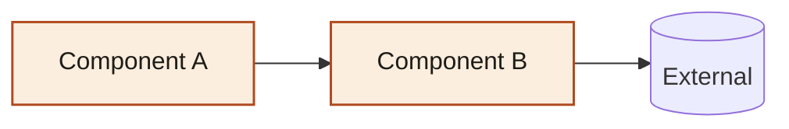

# <项目/Feature 名称> Implementation Plan

> 本模板与 `impl-explain` skill 配套。按这个结构写 plan，agent 跑 `/impl-explain` 时几乎不需要推断，能直接把段落字面映射到 HTML 报告的对应 section。
>
> 模板各段对应 HTML 报告段落：
>
> | 模板段 | 报告段 |
> | --- | --- |
> | TL;DR | TL;DR 三行 |
> | Architecture | Architecture 图（含可选 summary / caption） |
> | Data Flow | Before / After |
> | Decisions | Decisions 卡片 |
> | Risks | Risks 列表 + 风险概览 |
> | Out of Scope | Out of Scope 列表 |
> | Metrics (可选) | Hero metrics 三连 |
>
> 如果某段没有内容，**直接删掉**，不要留 placeholder。

**日期**: YYYY-MM-DD
**作者**: <name>
**前置文档**: <可选, brainstorm / spec 链接>

---

## TL;DR

- **目标**: 一句话, ≤60 字。说"做什么"而不是"怎么做"。
- **方案**: 一句话, ≤80 字。"用 X 把 Y 收敛到 Z"。
- **代价**: 一句话, ≤60 字。**整体账**——"换走 A，引入 B"。**不要复述任何一条 Decision 的局部 cost**；那是 Decision 的事。

> 检查：把这三句念给没看过 plan 的同事听，30 秒内能让对方理解大致在做什么？做不到就重写。

## Metrics (可选)

如果本次实施有强烈的"量级感"数字（如 "47→1 loops"、"4 sources unified"、"6 决策"），列在这里，agent 会渲染为 Hero metric chips：

- **决策**: 6
- **风险**: 5（1 high）
- **源类型收敛**: 4→1

不写也行，render 会自动派生 `决策数 / 风险数`。

## Architecture

可选的 **2-3 句话叙述**，描述高层架构意图（agent 会把它放在图上方，作为 `architecture_diagram.summary`）。

然后是 mermaid 源码：

**可选 caption**：用 `> Caption:` 前缀，agent 提取后渲染为图下方的 italic 说明。

> Caption: 橙色块 = 本次新增；箭头标签 = dispatch kind。

**提示**：用 `classDef newcomp` 把新组件标出来，**不要**写 `style X fill:#暗色`（会跟报告的浅色主题打架）。

## Data Flow

只在改动确实改变了系统数据流时才需要这段。

### Before

### After

## Decisions

至少 3 条，至多 8 条。挑那些"反过来选会出大问题"的关键决策。

### Decision 1: <结论式短标题, 比如 "集中注册表放 cadence">

- **Question** (可选): <原问题, 比如 "数据源 cadence 信息放哪？"——作为标题副文字>
- **Chosen**: 最终选择, 一两句话
- **Rejected**:
  - 备选 1
  - 备选 2
- **Rationale**: 2-4 句, 说清楚选择的理由
- **Cost**: 本条决策的**局部代价**（不复述 TL;DR 的整体账）
- **Status**: `chosen` 或 `deferred`

> ⚠️ `status` 只有这两种取值。**`rejected` 已废弃**——如果一个决策的所有备选都被否决，那它应该放进 `Out of Scope`，不是 Decisions。

### Decision 2: ...

### Decision 3: ...

## Risks

每条按下面格式写，agent 提取时把 `—` 之前的部分作为 description，**不要**把 metadata 整行带进描述：

- **<风险描述>** — severity: `high` | `medium` | `low` — mitigation: `full` | `partial` | `none`
  - Note: 缓解措施 / 观察方法 / 触发条件

至少列 2-3 条。**"无风险" 不真实**——至少想想"多副本部署"、"依赖第三方"、"静默失败"这三类常见隐患。

**mitigation rule of thumb**：如果 Note 里出现 "future"、"后续"、"暂未接入"、"上线后再调" 等字样，多半是 `partial` 而不是 `full`。

## Out of Scope

故意没做的事，用具体一句话。不要写"未来可能优化"这种空话。

- 暂未做 leader election（多副本部署时会重复跑）
- 没接 Prometheus / Sentry 告警
- ...

## Tasks（执行清单, 不进 HTML 报告）

> 本段不会被 impl-explain 渲染，但 plan executor 会按它跟踪进度。

### Task 1: ...

- [ ] step 1
- [ ] step 2
- [ ] 验证

### Task 2: ...

- [ ] ...

---

## 写好 plan 的几个反例

**反例 1：Decision title 写成 "我们用了 Redis"**

太短，没有 chosen vs rejected，没有 rationale。重写成：

> ### Decision: 缓存层选 Redis 而非 in-memory dict
>
> - Question: 缓存层选 Redis 还是 in-memory dict?
> - Chosen: Redis
> - Rejected: in-memory dict / Memcached
> - Rationale: 多副本部署时 in-memory 各副本数据不一致; Memcached 没有原子 incr 适合做计数器但本场景需要 hash 操作
> - Cost: 引入一个外部依赖，本地开发需要 docker-compose 起 Redis
> - Status: chosen

**反例 2：Risk 写成 "可能有 bug"**

太宽泛, 没法行动。重写成：

> - **Cache key collision 风险**: 多个 service 共用同一个 Redis prefix 时，key 命名冲突会读到错的数据 — severity: medium — mitigation: full
>   - Note: 强制每个 service 用 `ServiceName + ":"` 前缀，单元测试覆盖

**反例 3：Out of Scope 写成 "性能优化"**

太空泛。重写成：

> - 没做 connection pool 调优（默认 size 10）
> - 没做 read replica 路由
> - 没做 query 级 timeout（共用 client 级 60s timeout）

**反例 4：TL;DR.tradeoff 重复了 Decision.cost**

错误版（局部账）：

> 多一层注册表抽象，新增 source kind 时需要在 SourceSyncService._run_definition 加分支

正确版（整体账）：

> 换走 47 个 per-feed loop 的复杂度，引入 1 个调度器单点故障 + 多副本部署需重启切换

`tradeoff` 是"这次改动总的得失账"；具体某条决策的代价留在该 Decision 的 Cost 里。
